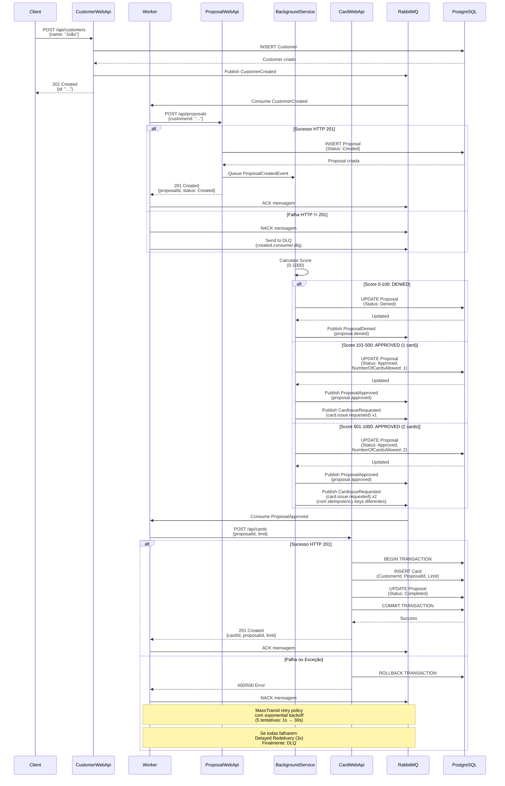

# Paraná Banco RT

Sistema de gestão de propostas de crédito e emissão de cartões.

## Arquitetura

O sistema é composto por múltiplos serviços que se comunicam via mensageria (RabbitMQ) e chamadas HTTP REST:

- **CustomerWebApi**: Gerenciamento de clientes
- **ProposalWebApi**: Gerenciamento de propostas de crédito
- **CardWebApi**: Gerenciamento de cartões
- **Worker**: Consumidor de mensagens e orquestrador de processos

## Fluxo de Criação de Cartão



## Tecnologias

- **.NET 8.0**
- **ASP.NET Core** (Web APIs)
- **Entity Framework Core** (ORM)
- **PostgreSQL** (Banco de dados)
- **RabbitMQ** (Message Broker)
- **MassTransit** (Messaging Framework)
- **Polly** (Resilience Policies)
- **FluentValidation** (Validação de DTOs)
- **FluentResults** (Padrão Result)

## Estrutura do Projeto

```
src/
├── Core/                    # Entidades de domínio e interfaces
│   ├── CustomerAggregate/  # Agregado de Customer
│   ├── Interfaces/          # Interfaces (Repositories, UnitOfWork)
│   ├── Messaging/           # Contratos de mensageria
│   └── Shared/              # Eventos compartilhados
├── Application/             # Casos de uso e lógica de aplicação
│   ├── UseCases/            # Implementação dos casos de uso
│   ├── Events/              # Event Handlers
│   ├── Extensions/          # Extensions (Result)
│   └── Middleware/          # Middleware (Exception Handler)
├── Infrastructure/          # Implementações de infraestrutura
│   ├── Data/                # DbContext e Migrations
│   ├── Repository/          # Implementação de Repositories
│   ├── UnitOfWork/          # Implementação de UnitOfWork
│   ├── Messaging/           # Configuração MassTransit
│   └── DesignTime/          # Factory para Migrations
├── CustomerWebApi/          # API de Clientes
├── ProposalWebApi/          # API de Propostas
├── CardWebApi/              # API de Cartões
└── Worker/                  # Consumer Worker
    ├── Consumers/           # Consumidores de mensagens
    └── Resilience/          # Políticas de resiliência (Polly)
```

## Padrões e Práticas

### 1. **Padrão Result (FluentResults)**
Todos os métodos de repositório e casos de uso retornam `Result<T>` ou `Result`, facilitando o tratamento de erros sem exceções.

### 2. **Unit of Work**
Abstração de transações do Entity Framework para garantir operações atômicas.

### 3. **Resiliência (Polly)**
Políticas aplicadas aos HttpClient:
- **Retry**: 3 tentativas com exponential backoff (2s, 4s, 8s)
- **Circuit Breaker**: Abre após 5 falhas, fica aberto por 30s
- **Timeout**: 30 segundos por requisição

### 4. **MassTransit Retry**
- **Message Retry**: 5 tentativas com exponential backoff (1s → 30s)
- **Delayed Redelivery**: 3 tentativas com delays maiores (1min → 10min)
- **Dead Letter Queue**: Mensagens que falharam após todos os retries

### 5. **Exception Handling**
Middleware global que captura todas as exceções não tratadas e retorna respostas no formato RFC 9110 (ProblemDetails).

## Configuração

### Requisitos
- .NET 8.0 SDK
- PostgreSQL 14+
- RabbitMQ 3.12+

### Variáveis de Ambiente

```bash
# Connection String
DEFAULT_CONNECTION=Host=localhost;Port=5432;Database=parana_banco_rt_db;Username=postgres;Password=postgres

# RabbitMQ
RabbitMQ__Host=localhost
RabbitMQ__Port=5672
RabbitMQ__Username=guest
RabbitMQ__Password=guest
RabbitMQ__VirtualHost=/
```

### Docker Compose

Execute o Docker Compose para subir PostgreSQL e RabbitMQ:

```bash
docker compose -f solutionItems/compose.yaml up -d
```

## Status da Proposta

- **Created**: Proposta criada, aguardando avaliação de score
- **Approved**: Proposta aprovada, cartão(ões) podem ser criados
- **Denied**: Proposta negada
- **Completed**: Cartão criado, proposta finalizada

## Regras de Negócio

### Avaliação de Score
- **0-100**: DENIED (negado)
- **101-500**: APPROVED com 1 cartão (limite: R$ 1.000,00)
- **501-1000**: APPROVED com 2 cartões (limite: R$ 2.000,00 cada)

### Relacionamentos
- 1 Customer → N Proposals
- 1 Customer → N Cards
- 1 Proposal → 1 Card (one-to-one)

## Resiliência e Tratamento de Erros

### HTTP Calls
- Retry automático com exponential backoff (3 tentativas)
- Circuit Breaker para evitar sobrecarga
- Timeout de 30 segundos

### Message Processing
- Retry no nível do MassTransit (5 tentativas)
- Delayed Redelivery (3 tentativas com delays maiores)
- Dead Letter Queue para falhas persistentes

### Exception Handling
- Middleware global captura todas as exceções
- Respostas no formato RFC 9110 (ProblemDetails)
- Stack trace apenas em ambiente de desenvolvimento
