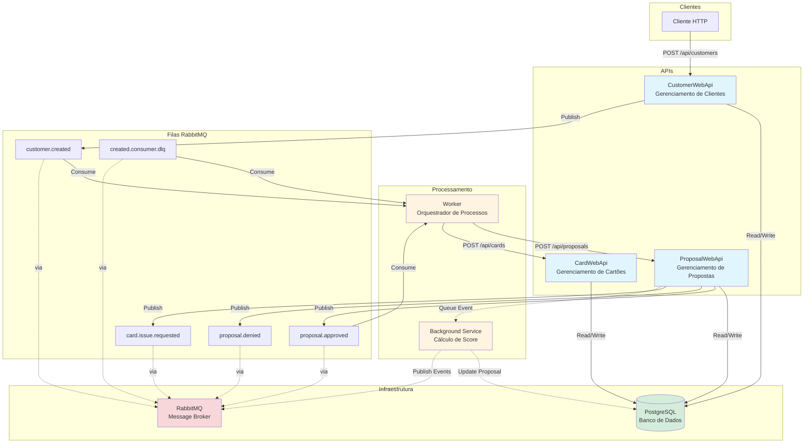

# Diagrama de Arquitetura - Paraná Banco RT

## Descrição dos Componentes

### APIs
- **CustomerWebApi**: Gerencia clientes, persiste no banco e publica evento `customer.created`
- **ProposalWebApi**: Gerencia propostas de crédito, possui Background Service para cálculo de score
- **CardWebApi**: Gerencia cartões emitidos

### Processamento
- **Worker**: Consome mensagens do RabbitMQ e faz orquestração via HTTP REST para outras APIs
- **Background Service**: Processa propostas em background, calcula score e publica eventos

### Infraestrutura
- **PostgreSQL**: Banco de dados compartilhado para todas as APIs
- **RabbitMQ**: Message broker para comunicação assíncrona entre serviços

### Filas Principais
- `customer.created`: Evento publicado quando um cliente é criado
- `proposal.approved`: Evento publicado quando uma proposta é aprovada
- `proposal.denied`: Evento publicado quando uma proposta é negada
- `card.issue.requested`: Evento publicado para solicitar emissão de cartão
- `created.consumer.dlq`: Dead Letter Queue para mensagens que falharam

