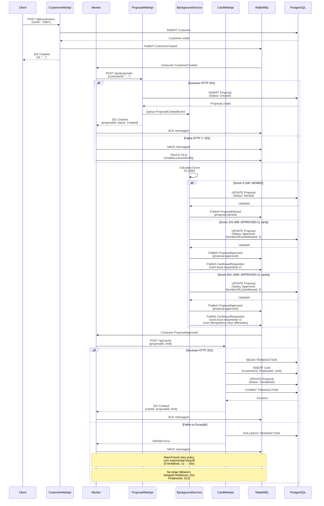

```mermaid
sequenceDiagram
    participant Client
    participant CustomerAPI as CustomerWebApi
    participant Worker
    participant ProposalAPI as ProposalWebApi
    participant BackgroundService
    participant CardAPI as CardWebApi
    participant RabbitMQ
    participant Database as PostgreSQL

    Client->>CustomerAPI: POST /api/customers<br/>{name: "João"}
    CustomerAPI->>Database: INSERT Customer
    Database-->>CustomerAPI: Customer criado
    CustomerAPI->>RabbitMQ: Publish CustomerCreated
    CustomerAPI-->>Client: 201 Created<br/>{id: "..."}

    RabbitMQ->>Worker: Consume CustomerCreated
    Worker->>ProposalAPI: POST /api/proposals<br/>{customerId: "..."}
    
    alt Sucesso HTTP 201
        ProposalAPI->>Database: INSERT Proposal<br/>(Status: Created)
        Database-->>ProposalAPI: Proposal criada
        ProposalAPI->>BackgroundService: Queue ProposalCreatedEvent
        ProposalAPI-->>Worker: 201 Created<br/>{proposalId, status: Created}
        Worker->>RabbitMQ: ACK mensagem
    else Falha HTTP != 201
        Worker->>RabbitMQ: NACK mensagem
        Worker->>RabbitMQ: Send to DLQ<br/>(created.consumer.dlq)
    end

    BackgroundService->>BackgroundService: Calculate Score<br/>(0-1000)
    
    alt Score 0-100: DENIED
        BackgroundService->>Database: UPDATE Proposal<br/>(Status: Denied)
        Database-->>BackgroundService: Updated
        BackgroundService->>RabbitMQ: Publish ProposalDenied<br/>(proposal.denied)
    else Score 101-500: APPROVED (1 card)
        BackgroundService->>Database: UPDATE Proposal<br/>(Status: Approved,<br/>NumberOfCardsAllowed: 1)
        Database-->>BackgroundService: Updated
        BackgroundService->>RabbitMQ: Publish ProposalApproved<br/>(proposal.approved)
        BackgroundService->>RabbitMQ: Publish CardIssueRequested<br/>(card.issue.requested) x1
    else Score 501-1000: APPROVED (2 cards)
        BackgroundService->>Database: UPDATE Proposal<br/>(Status: Approved,<br/>NumberOfCardsAllowed: 2)
        Database-->>BackgroundService: Updated
        BackgroundService->>RabbitMQ: Publish ProposalApproved<br/>(proposal.approved)
        BackgroundService->>RabbitMQ: Publish CardIssueRequested<br/>(card.issue.requested) x2<br/>(com idempotency keys diferentes)
    end

    RabbitMQ->>Worker: Consume ProposalApproved
    Worker->>CardAPI: POST /api/cards<br/>{proposalId, limit}
    
    alt Sucesso HTTP 201
        CardAPI->>Database: BEGIN TRANSACTION
        CardAPI->>Database: INSERT Card<br/>(CustomerId, ProposalId, Limit)
        CardAPI->>Database: UPDATE Proposal<br/>(Status: Completed)
        CardAPI->>Database: COMMIT TRANSACTION
        Database-->>CardAPI: Success
        CardAPI-->>Worker: 201 Created<br/>{cardId, proposalId, limit}
        Worker->>RabbitMQ: ACK mensagem
    else Falha ou Exceção
        CardAPI->>Database: ROLLBACK TRANSACTION
        CardAPI-->>Worker: 400/500 Error
        Worker->>RabbitMQ: NACK mensagem
        Note over Worker,RabbitMQ: MassTransit retry policy<br/>com exponential backoff<br/>(5 tentativas: 1s → 30s)
        Note over Worker,RabbitMQ: Se todas falharem:<br/>Delayed Redelivery (3x)<br/>Finalmente: DLQ
    end
```